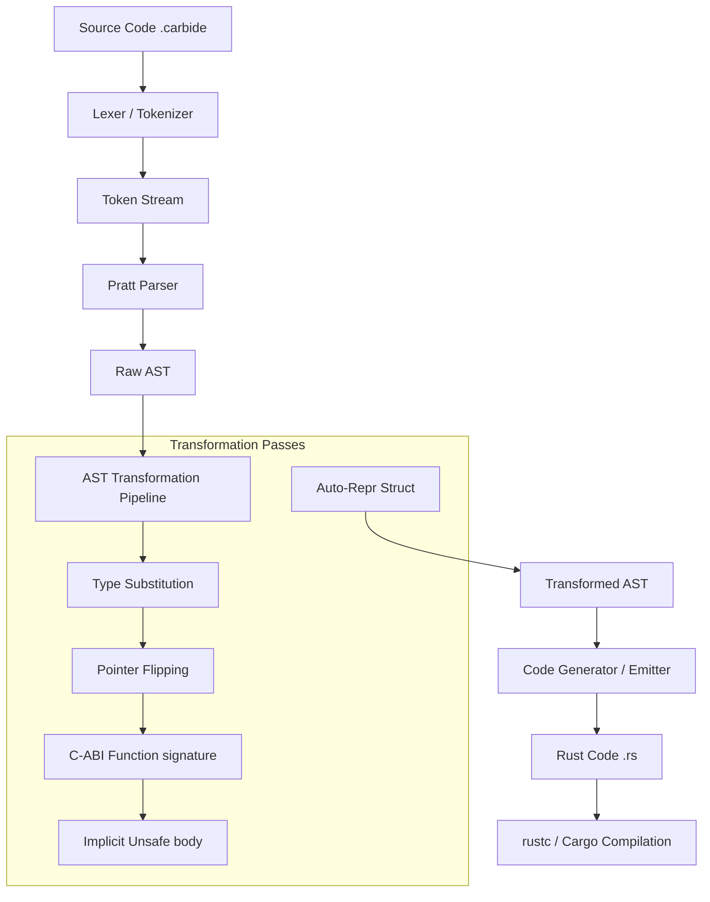

# Carbide: C-Style Rust Transpiler

<p align="center">
  
</p>

`carbide` is a transpiler and compiler frontend that compiles a custom dialect of Rust (`.carbide`) featuring C-style keywords and postfix pointer syntax into standard, FFI-compliant Rust code. It includes an integrated driver to call `rustc` directly and a custom Cargo subcommand (`cargo-carbide`) that automatically manages FFI compilation targets and compiles pure static/dynamic libraries.

## Architecture

The compiler is structured as a classical compiler pipeline:



---

## Dialect Specification (The Grammar)

Carbide extends Rust by permitting C-style declarations and pointers in signatures:

### 1. Primitive C Types
The transpiler automatically maps C-style primitive type keywords:
- `void` $\rightarrow$ `core::ffi::c_void`
- `char` $\rightarrow$ `core::ffi::c_char`
- `signed char` $\rightarrow$ `core::ffi::c_schar`
- `unsigned char` $\rightarrow$ `core::ffi::c_uchar`
- `short` $\rightarrow$ `core::ffi::c_short`
- `unsigned short` $\rightarrow$ `core::ffi::c_ushort`
- `int` $\rightarrow$ `core::ffi::c_int`
- `unsigned int` / `unsigned` $\rightarrow$ `core::ffi::c_uint`
- `long` $\rightarrow$ `core::ffi::c_long`
- `unsigned long` $\rightarrow$ `core::ffi::c_ulong`
- `long long` $\rightarrow$ `core::ffi::c_longlong`
- `unsigned long long` $\rightarrow$ `core::ffi::c_ulonglong`
- `float` $\rightarrow$ `core::ffi::c_float`
- `double` $\rightarrow$ `core::ffi::c_double`
- `long double` $\rightarrow$ `core::ffi::c_double`
- Standard Rust types (e.g. `i32`, `u8`, `f32`, `bool`) are supported 100% and bypassed by the transpiler.

### 2. libc Integration
Standard `libc` types are supported:
- `size_t` $\rightarrow$ `libc::size_t`
- `ssize_t` $\rightarrow$ `libc::ssize_t`
- `ptrdiff_t` $\rightarrow$ `libc::ptrdiff_t`
- `uintptr_t` $\rightarrow$ `libc::uintptr_t`
- `intptr_t` $\rightarrow$ `libc::intptr_t`
- `off_t` $\rightarrow$ `libc::off_t`
- `pid_t` $\rightarrow$ `libc::pid_t`

### 3. Postfix Pointer Notation
Carbide supports C-style postfix pointer syntax:
- `T*` $\rightarrow$ `*mut T` (Mutable pointer)
- `T const*` $\rightarrow$ `*const T` (Constant pointer)
- `T**` $\rightarrow$ `*mut *mut T` (Nested pointers)

### 4. Automatic FFI Attributes & Crate Directives
- **no_std**: The `#![no_std]` crate attribute is automatically prepended to every generated file, ensuring low-level and bare-metal compilation compatibility.
- **Conditional libc**: `use libc::*;` is conditionally imported only if libc-specific types (e.g., `size_t`, `pid_t`) are referenced in the source AST, keeping simple transpiled files free from external dependencies.
- **C-ABI**: Every top-level function or procedure is automatically injected with the `extern "C"` ABI calling convention and the `#[no_mangle]` attribute.
- **Function/Procedure Safety (`fn` vs `proc`)**:
  - `fn` declarations: Safe by default (emits standard `fn` in Rust, does **not** implicitly wrap body statements in unsafe).
  - `proc` declarations: Unsafe by default (emits `unsafe fn` in Rust, and automatically wraps all body statements in an implicit `unsafe {}` block, permitting low-level pointer dereferencing and arithmetic).
  - Explicit `unsafe fn` declarations are also supported and behave like `proc` (unsafe with implicit body wrapping).
- **Auto-Repr**: Every struct definition in the AST is automatically prepended with the `#[repr(C)]` attribute to ensure stable C memory layout.

---

## Workspace Layout

- `src/main.rs`: Command Line Interface parser and Cargo subcommand router.
- `src/lexer.rs`: Token definitions and tokenizer logic. Handles C primitive keywords and postfix `*` symbols.
- `src/ast.rs`: Intermediate representation nodes for items, functions, structs, statements, and expressions.
- `src/parser.rs`: Hand-written recursive descent Pratt parser. Solves operator precedence for field access (`.`) and dereferences (`*`).
- `src/transform.rs`: Runs structural mutation passes over the AST.
- `src/emitter.rs`: Formats the transformed AST back into compliant Rust code. Includes a precedence-aware expression formatter.
- `tests/integration_tests.rs`: Multi-stage pipeline verification test.
- `tests/fixture_tests.rs`: Fixture-based runner that compiles all `.carbide` files under `tests/fixtures/`.

---

## Usage

### 1. Direct Compilation
Run the transpiler directly on a `.carbide` file:
```powershell
# Transpile only (generates main.rs)
carbide main.carbide

# Transpile to custom output path
carbide main.carbide -o output.rs

# Transpile and immediately compile using rustc
carbide main.carbide -c
```

### 2. Cargo subcommand Integration
To build a static library or dynamic library:
```powershell
# Transpile all .carbide files in src/ and compile the project
cargo carbide build
```
The subcommand:
1. Creates a temporary compilation workspace under `target/carbide_workspace`.
2. Automatically generates/injects FFI crate targets:
   ```toml
   [lib]
   crate-type = ["staticlib", "cdylib"]
   ```
3. Performs the build and copies FFI static/dynamic libraries (`carbide.lib`, `libcarbide.a`, `carbide.dll`) back to the main project's `target/debug/` directory.
