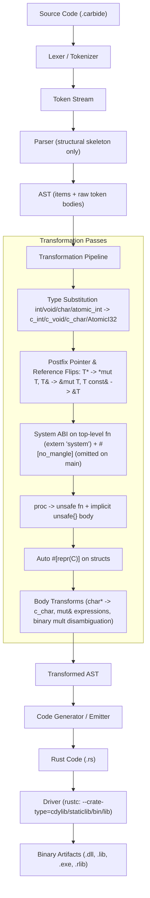

# Carbide: C/C++-Style Rust Transpiler

<p align="center">
  
</p>

`carbide` is a transpiler and compiler frontend that compiles a custom dialect of Rust (`.carbide`) featuring C/C++-style keywords, postfix pointer (`*`) and reference (`&`) syntax, C atomics, and FFI conventions into standard, FFI-compliant Rust code, and directly drives `rustc` to produce static libraries (`.lib`/`.a`), dynamic DLLs (`.dll`/`.so`/`.dylib`), or executables (`.exe`). The transpiler applies well-defined syntactic transformations and passes all other Rust code through unchanged, so **any valid Rust code works in a `.carbide` file**. It includes an integrated driver to call `rustc` directly and a custom Cargo subcommand (`cargo-carbide`) that automatically manages FFI compilation targets and compiles pure static/dynamic libraries.

## Architecture

The compiler is structured as a transformation pipeline. The parser only deeply parses the structural skeleton (top-level items, function signatures, struct fields, type aliases). Statement bodies are captured as **verbatim token streams** and passed through a lightweight transformer. This design means any valid Rust inside a function body passes through verbatim after type substitutions:



---

## Target Compilation Flags

`carbide` can directly compile `.carbide` source files into binary artifacts without manual `rustc` invocation:

| Flag | Crate Type | Output Artifact | Description |
|:---|:---|:---|:---|
| `--dll` / `--cdylib` / `--dylib` | `cdylib` | `.dll` / `.so` / `.dylib` | Dynamic C-compatible shared library |
| `--static` / `--staticlib` | `staticlib` | `.lib` / `.a` | Static C-compatible archive |
| `--exe` / `--bin` | `bin` | `.exe` / ELF binary | Standalone executable |
| `--lib` / `--rlib` | `lib` | `.rlib` | Rust library |
| `--crate-type=<TYPE>` | Custom | Per crate type | Direct pass-through to `rustc` |
| `-o <FILE>` | Custom | `.rs` or binary | Destination path for source or binary artifact |

---

## Dialect Specification

Carbide extends Rust by permitting C and C++ style declarations, pointers, references, and atomics in signatures and local bindings:

### 1. Primitive C Types & Void Handling
The transpiler automatically maps C-style primitive type keywords:
- `void` $\rightarrow$ `core::ffi::c_void` (under raw pointers like `void*` $\rightarrow$ `*mut c_void`).
- `void` in function/callback return position $\rightarrow$ omitted return type / unit `()` (since Rust `c_void` is an uninhabited type that cannot be returned by value).
- `char` $\rightarrow$ `core::ffi::c_char` (and `char*` $\rightarrow$ `*mut c_char`).
- `signed char` $\rightarrow$ `core::ffi::c_schar`
- `unsigned char` $\rightarrow$ `core::ffi::c_uchar`
- `short` $\rightarrow$ `core::ffi::c_short`
- `unsigned short` $\rightarrow$ `core::ffi::c_ushort`
- `int` $\rightarrow$ `core::ffi::c_int`
- `unsigned int` / `unsigned` / `uint` $\rightarrow$ `core::ffi::c_uint`
- `long` $\rightarrow$ `core::ffi::c_long`
- `unsigned long` $\rightarrow$ `core::ffi::c_ulong`
- `long long` $\rightarrow$ `core::ffi::c_longlong`
- `unsigned long long` $\rightarrow$ `core::ffi::c_ulonglong`
- `float` $\rightarrow$ `core::ffi::c_float`
- `double` $\rightarrow$ `core::ffi::c_double`
- `long double` $\rightarrow$ `core::ffi::c_double`
- Standard Rust types (e.g. `i32`, `u8`, `f32`, `bool`, `usize`) pass through unmodified.
- Any valid Rust control flow (`while`, `loop`, `match`, `if`/`else`, `break`, `continue`, closures `|x| x * 2`, operators `|`, `^`, `%`, `?`) is captured and emitted verbatim.

### 2. C/C++ Atomics & libc Integration
- **Atomics**: C/C++ atomic types are supported and map directly to `core::sync::atomic`:
  - `atomic_bool` $\rightarrow$ `core::sync::atomic::AtomicBool`
  - `atomic_int` $\rightarrow$ `core::sync::atomic::AtomicI32`
  - `atomic_uint` $\rightarrow$ `core::sync::atomic::AtomicU32`
  - `atomic_long` $\rightarrow$ `core::sync::atomic::AtomicI64`
  - `atomic_ulong` $\rightarrow$ `core::sync::atomic::AtomicU64`
  - `atomic_size_t` / `atomic_uintptr_t` $\rightarrow$ `core::sync::atomic::AtomicUsize`
  - `atomic_intptr_t` $\rightarrow$ `core::sync::atomic::AtomicIsize`
  - `use core::sync::atomic::*;` is automatically imported whenever atomics or `Ordering` are used.
- **libc Types**:
  - `size_t` $\rightarrow$ `libc::size_t`, `off_t` $\rightarrow$ `libc::off_t`, `pid_t` $\rightarrow$ `libc::pid_t`, etc.
  - `use libc::*;` is conditionally imported when libc types appear.

### 3. Postfix Pointers & References (C/C++ Conventions Exclusively)
Carbide exclusively uses C and C++ style postfix notation for both pointers (`*`) and references (`&`). Prefix syntax (`*const T`, `*mut T`, `&T`, `&mut T`, `const T*`, `const T&`) in type positions is disallowed:
- `T*` or `T mut*` $\rightarrow$ `*mut T` (Mutable raw pointer)
- `T const*` $\rightarrow$ `*const T` (Constant raw pointer)
- `T&` or `T mut&` $\rightarrow$ `&mut T` (Mutable reference / borrow)
- `T const&` $\rightarrow$ `&T` (Constant reference / borrow)
- `T**` $\rightarrow$ `*mut *mut T` (Nested pointers)
- `mut& expr` $\rightarrow$ `&mut expr` (Mutable borrow expression)

### 4. Automatic FFI Attributes & Crate Directives
- **Standard Library Default (`--std`)**: Carbide defaults to standard library mode and does not emit `#![no_std]`.
- **Bare-Metal Mode (`--no-std`)**: Passing `--no-std` explicitly emits `#![no_std]` at the top of generated files for bare-metal / embedded FFI targets.
- **System ABI on Top-Level Functions**: Free functions or procedures default to `extern "system"` calling convention with `#[no_mangle]` (omitted on `main` and `impl` methods).
- **`impl` Block Methods**: Methods in `impl` blocks emit standard Rust methods without `#[no_mangle]` to avoid global symbol collisions.
- **Function/Procedure Safety (`fn` vs `proc`)**:
  - `fn` declarations: Safe by default (emits standard `fn` in Rust, does **not** implicitly wrap body statements in unsafe).
  - `proc` declarations: Unsafe by default (emits `unsafe fn` in Rust, and automatically wraps all body statements in an implicit `unsafe {}` block, permitting low-level pointer dereferencing and arithmetic).
  - Explicit `unsafe fn` declarations are also supported and behave like `proc`.
- **Auto-Repr**: Every struct definition in the AST is automatically prepended with the `#[repr(C)]` attribute to ensure stable C memory layout.
- **FFI style lints**: Generated files carry `#![allow(non_camel_case_types)]`, `#![allow(non_snake_case)]`, and `#![allow(non_upper_case_globals)]`.

### 5. Function Pointer Types (C/System Callbacks)

C function pointers are written with `fn` in type position — inside struct fields, parameters, return types, or `type` aliases — and transpile to nullable `Option<unsafe extern "system" fn(…) [-> …]>`:

```carbide
struct clap_plugin {
    init: fn(plugin: clap_plugin const*) -> bool,
    destroy: fn(plugin: clap_plugin const*) -> void,
    process: fn(plugin: clap_plugin const*, process: clap_process const*) -> clap_process_status
}
```

```rust
#[repr(C)]
pub struct clap_plugin {
    pub init: Option<unsafe extern "system" fn(plugin: *const clap_plugin) -> bool>,
    pub destroy: Option<unsafe extern "system" fn(plugin: *const clap_plugin)>,
    pub process: Option<unsafe extern "system" fn(plugin: *const clap_plugin, process: *const clap_process) -> clap_process_status>,
}
```

### 6. Type Aliases (C typedefs)

```carbide
type clap_id = u32;
type AudioCallback = fn(buffer: void*, frames: uint) -> void;
type Texture2D = Texture;
```

---

## Workspace Layout

- `src/main.rs`: Command Line Interface parser with `--dll`, `--static`, `--exe`, `--lib`, `--std`, and `--no-std` flags, and Cargo subcommand router.
- `src/lexer.rs`: Token definitions and tokenizer logic. Supports C keywords, postfix `*` and `&`, and extended operators (`|`, `%`, `^`, `?`, `~`, `@`, `$`).
- `src/ast.rs`: Intermediate representation nodes. Function, struct, and type alias AST definitions.
- `src/parser.rs`: Hand-written recursive descent parser for structural items. Enforces C++-style postfix pointer/reference notation.
- `src/transform.rs`: AST and body transformation passes. Handles types, atomic mapping, pointer/reference flips, system ABI, and binary multiplication disambiguation.
- `src/emitter.rs`: Formats the transformed AST back into compliant Rust code with conditional imports for libc and atomics.
- `tests/integration_tests.rs`: Multi-stage pipeline verification test (transpile + `rustc` compile) across all reference fixtures in std, no-std, dll, staticlib, and exe modes.
- `tests/fixture_tests.rs`: Fixture test runner verifying transpiled output structure in `--std` and `--no-std` modes.
- `tests/fixtures/atomics_operators.carbide`: Atomics, closures, and operator expressions suite.
- `tests/fixtures/clap_audio.carbide`: The **CLAP audio plugin ABI** (free-audio/clap 1.2) written in Carbide.
- `tests/fixtures/raylib_api.carbide`: The **raylib API surface** (windowing, drawing, textures, and audio) written in Carbide.

---

## Usage

### 1. Direct Compilation
```powershell
# Transpile only (default std mode: generates main.rs without #![no_std])
carbide main.carbide

# Transpile to custom output path
carbide main.carbide -o output.rs

# Transpile in no_std mode (prepends #![no_std])
carbide main.carbide -o output.rs --no-std

# Compile directly to a dynamic DLL (.dll on Windows, .so on Linux)
carbide plugin.carbide --dll -o plugin.dll

# Compile directly to a static library archive (.lib on Windows, .a on Linux)
carbide engine.carbide --static -o engine.lib

# Compile directly to a native executable (.exe)
carbide app.carbide --exe -o app.exe

# Transpile and immediately compile using rustc
carbide main.carbide -c
```

### 2. Cargo Subcommand Integration
```powershell
# Transpile all .carbide files in src/ and compile the project
cargo carbide build

# Transpile in no_std mode
cargo carbide build --no-std
```

---

## License

MIT
