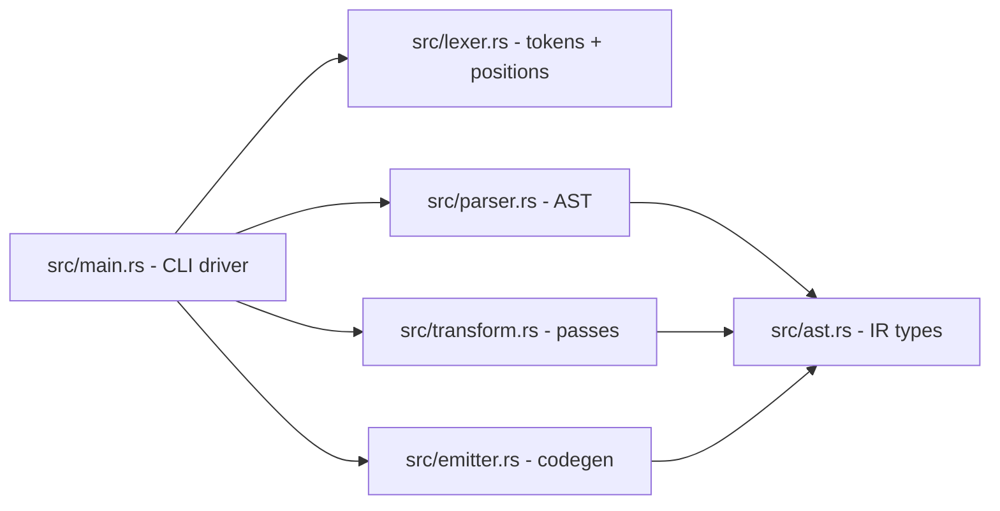

# Carbide — Software Requirements Specification

**Version:** 0.2.0
**Status:** Implemented
**Date:** 2026-07-31

---

## 1. Purpose

Carbide is a transpiler and compiler frontend that compiles **`.carbide`** files —
a low-level, C-flavoured dialect of Rust designed for seamless C ABI
compatibility — into standard, FFI-compliant `no_std` Rust. The dialect is
deliberately small: C-style primitive keywords, postfix pointer notation,
function-pointer types, and C typedef aliases are rewritten to their Rust FFI
equivalents; every other valid `no_std` Rust construct passes through verbatim.

This document is the normative specification (SRS) for the transpiler and for
the two reference API bindings shipped as fixtures:

1. **CLAP audio API** (`tests/fixtures/clap_audio.carbide`) — the CLever Audio
   Plugin ABI, the cross-DAW audio plugin interface.
2. **raylib API** (`tests/fixtures/raylib_api.carbide`) — the raylib game
   development library API surface (windowing, drawing, textures, audio).

---

## 2. Terminology

| Term       | Meaning                                                              |
|------------|----------------------------------------------------------------------|
| Carbide    | The source dialect (`.carbide` files).                               |
| Transpile  | The deterministic 1:1 source-to-source rewrite performed by `carbide`.|
| FFI type   | A Rust type usable across the C ABI (`core::ffi::c_int`, `*mut T`, …).|
| proc       | Carbide's unsafe-by-default procedure keyword.                       |
| fn-pointer | A C function pointer written `fn(params) -> ret` in Carbide.         |

---

## 3. Architecture

```
┌────────────┐   ┌──────────────┐   ┌──────────────┐   ┌───────────────┐
│ .carbide   │──▶│   Lexer      │──▶│   Parser     │──▶│   Transform   │
│ source     │   │ tokens+bytes │   │ AST (typed   │   │ type mapping, │
│            │   │              │   │  skeleton,   │   │ ptr flip,     │
│            │   │              │   │  raw bodies) │   │ C-ABI, repr(C)│
└────────────┘   └──────────────┘   └──────────────┘   └───────┬───────┘
                                                               ▼
                                                       ┌───────────────┐
                                                       │   Emitter     │
                                                       │ .rs (no_std)  │
                                                       └───────┬───────┘
                                                               ▼
                                                    ┌──────────────────────┐
                                                    │ Driver: rustc /      │
                                                    │ cargo-carbide build  │
                                                    └──────────────────────┘
```

### 3.1 Pipeline stages

| Stage      | Module       | Responsibility                                                |
|------------|--------------|---------------------------------------------------------------|
| Lexer      | `src/lexer.rs` | Tokenizes the source; records byte offsets for every token so the parser can slice verbatim bodies. |
| Parser     | `src/parser.rs` | Recursive-descent parser for the **structural skeleton only**: top-level items, `fn`/`proc` signatures, struct fields, `type` aliases. Function bodies are captured as verbatim source slices. |
| Transform  | `src/transform.rs` | Applies type substitutions (`int` → `c_int`), postfix-pointer flips (`T*` → `*mut T`), C-ABI injection, `#[repr(C)]`, and body-text word-boundary rewrites. |
| Emitter    | `src/emitter.rs` | Reassembles Rust source: `#![no_std]` header, conditional `use libc::*;`, and the transformed skeleton with verbatim bodies. |
| Driver     | `src/main.rs` | CLI (`carbide file.carbide [-o out.rs] [-c]`) and the `cargo carbide build` subcommand. |

### 3.2 Module boundaries



---

## 4. Dialect specification

### 4.1 Files and keywords

- File extension `.carbide`.
- Every transpiled file is prefixed with `#![no_std]` and
  `#![allow(non_camel_case_types)]`, `#![allow(non_snake_case)]`,
  `#![allow(non_upper_case_globals)]` (FFI style-lint hygiene, mirroring
  bindgen output).
- `use core::ffi::*;` is always emitted; `use libc::*;` is emitted
  **conditionally** when any libc type (`size_t`, `ssize_t`, `ptrdiff_t`,
  `uintptr_t`, `intptr_t`, `off_t`, `pid_t`) appears in the AST.

### 4.2 C primitive type mapping

| Carbide        | Rust FFI        |
|----------------|-----------------|
| `void`         | `c_void`        |
| `char`         | `c_char`        |
| `signed char`  | `c_schar`       |
| `unsigned char`| `c_uchar`       |
| `short`        | `c_short`       |
| `unsigned short`| `c_ushort`     |
| `int`          | `c_int`         |
| `unsigned int` / `uint` | `c_uint` |
| `long`         | `c_long`        |
| `unsigned long`| `c_ulong`       |
| `long long`    | `c_longlong`    |
| `unsigned long long` | `c_ulonglong` |
| `float`        | `c_float`       |
| `double`       | `c_double`      |
| `long double`  | `c_double`      |

Rust primitives (`i8`…`i128`, `u8`…`u128`, `isize`, `usize`, `f32`, `f64`,
`bool`, `str`) pass through **unchanged**. This is how CLAP/raylib bindings
express `stdint.h` types (`uint32_t` → `u32`).

### 4.3 Postfix pointers

| Carbide         | Rust       |
|-----------------|------------|
| `T*`            | `*mut T`   |
| `T const*`      | `*const T` |
| `T**`           | `*mut *mut T` |
| `T const* const*` | `*const *const T` |

### 4.4 Function declarations

- `fn name(...) -> T` → safe `pub extern "C" fn` + `#[no_mangle]`.
- `proc name(...) -> T` → `pub unsafe extern "C" fn` + `#[no_mangle]`; the body
  is emitted inside an unsafe context (raw pointer dereference allowed).
- Explicit `unsafe fn` behaves like `proc`.
- `extern "ABI"` on a declaration is preserved (default `C`).

### 4.5 Function-pointer types (new in 0.2.0)

C callbacks are written with `fn` in **type position** — in struct fields,
parameters, return types, and `type` aliases:

```carbide
struct clap_plugin {
    init: fn(plugin: clap_plugin const*) -> bool,
    process: fn(plugin: clap_plugin const*, process: clap_process const*) -> clap_process_status
}
```

Emits:

```rust
#[repr(C)]
pub struct clap_plugin {
    pub init: Option<unsafe extern "C" fn(plugin: *const clap_plugin) -> bool>,
    pub process: Option<unsafe extern "C" fn(plugin: *const clap_plugin, process: *const clap_process) -> clap_process_status>,
}
```

Rules:

1. Parameter names are kept (valid in Rust fn-pointer types and self-documenting).
2. The whole type is wrapped in `Option<…>`: C callbacks are nullable, and
   `Option<fn>` is FFI-safe via the null-pointer optimisation (same
   representation as `clap-sys` / `raylib-rs`).
3. The ABI is `extern "C"` and calling is `unsafe` — inherent to FFI callbacks.
4. Inner parameter/return types are fully transformed (recursion into
   `Type::FnPointer` in the transform pass).
5. The postfix-pointer loop applies greedily to the *return type* first, so
   `fn(a: int) -> int const*` returns `*const c_int`; a pointer-to-fn-pointer
   requires explicit Rust syntax and is out of scope.

### 4.6 Type aliases (new in 0.2.0)

C `typedef`s map to `type` items whose RHS is parsed and transformed:

```carbide
type clap_id = u32;
type AudioCallback = fn(buffer: void*, frames: uint) -> void;
type Texture2D = Texture;
```

Emits:

```rust
pub type clap_id = u32;
pub type AudioCallback = Option<unsafe extern "C" fn(buffer: *mut c_void, frames: c_uint) -> c_void>;
pub type Texture2D = Texture;
```

### 4.7 Structs

- Every struct is `#[repr(C)]` and `pub`.
- Fields may be any parseable type: primitives, pointers, arrays
  (`name: [char; 256]` → `[c_char; 256]`), fn-pointers, and other structs.
- Empty structs (`struct rAudioBuffer {}`) emit as opaque `#[repr(C)]` handles
  for forward-referenced C types.

### 4.8 Raw items

`const`, `static`, and other unparsed top-level items pass through verbatim as
raw source and **keep their terminating `;`** (fixed in 0.2.0):

```carbide
const CLAP_VERSION_MAJOR: u32 = 1;
#[no_mangle]
pub static clap_entry: clap_plugin_entry = clap_plugin_entry { /* … */ };
```

### 4.9 enums / impls / use

- `enum` bodies pass through verbatim (variants are not type-mapped).
- `impl` blocks are parsed; methods get the standard `fn`/`proc` treatment.
- `use path;` items are re-emitted verbatim.

---

## 5. Reference binding: CLAP audio API

**Fixture:** `tests/fixtures/clap_audio.carbide`
**Source ABI:** [free-audio/clap](https://github.com/free-audio/clap) `include/clap/*.h` (MIT)
**Reference Rust binding:** `clap-sys`

The fixture transpiles the core CLAP 1.2 ABI into `no_std` Rust:

| CLAP header | Bound types |
|-------------|-------------|
| `id.h`, `process.h`, `fixedpoint.h`, `events.h`, `params.h`, `log.h` | `type clap_id = u32`, `clap_process_status`, `clap_beattime`, `clap_sectime`, `clap_note_expression`, `clap_param_info_flags`, `clap_log_severity` |
| `version.h` | `clap_version`, version constants |
| `audio-buffer.h` | `clap_audio_buffer` (nested `float**` / `double**`) |
| `events.h` | `clap_event_header`, note/param/transport/midi events, `clap_input_events` + `clap_output_events` (fn-pointer lists) |
| `process.h` | `clap_process` |
| `stream.h` | `clap_istream`, `clap_ostream` |
| `plugin.h` | `clap_plugin_descriptor`, `clap_plugin` (12 fn-pointer members) |
| `host.h` | `clap_host` |
| `ext/params.h` | `clap_param_info` (`[c_char; 256]`/`[c_char; 1024]` arrays), `clap_plugin_params` |
| `ext/state.h` | `clap_plugin_state`, `clap_host_state` |
| `ext/audio-ports.h` | `clap_audio_port_info`, `clap_plugin_audio_ports` |
| `ext/note-ports.h` | `clap_note_port_info`, `clap_plugin_note_ports` |
| `ext/log.h` | `clap_host_log` |
| `factory/plugin-factory.h` | `clap_plugin_factory` |
| `entry.h` | `clap_plugin_entry` + `#[no_mangle] pub static clap_entry` |

Deliberate deviations (documented in-file):

- `clap_event_header.type` is renamed to `kind` (`type` is a Rust keyword;
  `clap-sys` uses `type_`).
- C unions (`clap_event`) are modelled as plain structs; only the common
  header and the concrete payloads are bound.
- Extension string IDs (`CLAP_EXT_*`) are runtime C strings, not part of the
  type ABI; the fixture documents them in comments.
- Plugin method *implementations* are user code; the fixture provides
  `clap_version_is_compatible` (safe `fn`) and `plugin_has_init` (`proc`) as
  examples of bodies that dereference the bound types.

---

## 6. Reference binding: raylib API

**Fixture:** `tests/fixtures/raylib_api.carbide`
**Source ABI:** [raysan5/raylib](https://github.com/raysan5/raylib) `src/raylib.h` (zlib)
**Reference Rust binding:** `raylib-rs`

The fixture covers a representative slice of raylib:

| Area | Bound types / functions |
|------|-------------------------|
| Typedefs | `type Texture2D = Texture`, `TextureCubemap`, `RenderTexture2D`, `Quaternion`, `AudioCallback` (fn-pointer typedef) |
| Math/colour | `Vector2`, `Vector3`, `Vector4`, `Matrix`, `Color`, `Rectangle` |
| Textures | `Image`, `Texture`, `RenderTexture`, `GlyphInfo`, `Font` |
| Cameras | `Camera3D`, `Camera2D` |
| Audio | opaque `rAudioBuffer`/`rAudioProcessor`, `Wave`, `AudioStream`, `Sound`, `Music` |
| Window/core | `InitWindow`, `CloseWindow`, `WindowShouldClose`, `SetTargetFPS`, `GetFrameTime`, `GetTime`, `IsKeyPressed`, … |
| Drawing | `BeginDrawing`/`EndDrawing`, `ClearBackground`, `DrawPixel/Line/Rectangle/Circle/Text/TextEx`, `DrawFPS` |
| Textures | `LoadTexture`, `UnloadTexture`, `DrawTexture`, `BeginTextureMode`/`EndTextureMode` |
| Audio | `InitAudioDevice`/`CloseAudioDevice`, `LoadWave`/`LoadSound`/`LoadMusicStream`, playback + volume functions, `SetAudioStreamCallback(stream, callback: AudioCallback)` |

Every `proc` is a stub (`unimplemented!()`) — the fixture is an API-surface
contract; real projects link the C library or implement the functions in Rust.
Two helpers (`raylib_color`, `vector2_length_squared`) carry real bodies to
demonstrate usable Carbide code.

---

## 7. Emitted header (both bindings)

```rust
#![no_std]
#![allow(non_camel_case_types)]
#![allow(non_snake_case)]
#![allow(non_upper_case_globals)]

use core::ffi::*;
// use libc::*;  (only when a libc type is referenced)
```

---

## 8. Testing strategy

| Suite | File | Coverage |
|-------|------|----------|
| Unit — lexer/parser/transform/emitter | inline `#[cfg(test)]` | Token streams, AST shapes, type mapping, postfix flips, fn-pointer + type-alias parsing/emission |
| Fixture content | `tests/fixture_tests.rs` | Transpiles every `tests/fixtures/*.carbide`, asserts emitted Rust contains the expected signatures/fields; dedicated tests for `clap_audio` and `raylib_api` |
| Compile integration | `tests/integration_tests.rs` | Transpiles `ffi_compute`, `clap_audio`, `raylib_api` and **compiles the generated Rust with `rustc --crate-type=lib`** |

Regression notes:

- Raw items (`const`, `static`) must retain their terminating `;`.
- Fn-pointer fields must emit as `Option<unsafe extern "C" fn(…) -> …>` with a
  single closing `>`.
- `clap_audio.carbide` / `raylib_api.carbide` must not pull in `libc` (they use
  Rust primitives and `core::ffi` types only).

---

## 9. Build and run

```powershell
# Build the transpiler
cargo build

# Transpile a single file (emits <name>.rs or -o target)
.\target\debug\carbide.exe tests\fixtures\clap_audio.carbide -o out.rs
.\target\debug\carbide.exe tests\fixtures\clap_audio.carbide -c   # + rustc

# Full test suite (48 tests: 19 unit + 19 unit + 7 fixture + 3 integration)
cargo test

# Cargo subcommand: build an FFI staticlib/cdylib from src/*.carbide
cargo carbide build
```

---

## 10. Non-goals / future work

- C unions (`clap_event`) are not first-class; they are approximated as
  structs.
- Pointer-to-fn-pointer in postfix notation is unsupported (requires
  `Option<unsafe extern "C" fn(…) -> …>` written by hand).
- `enum` variants are not type-mapped.
- Attribute parsing is limited to simple `#[name]` tokens.
- The fixture procedures are stubs; no run-time linking against the actual
  CLAP/raylib C libraries is performed by the test suite.
