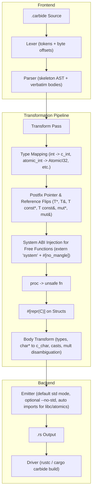

# Carbide — Software Requirements Specification

**Version:** 0.5.0
**Status:** Implemented
**Date:** 2026-08-11

---

## 1. Purpose

Carbide is a transpiler and compiler frontend that compiles **`.carbide`** files —
a low-level, C/C++-flavoured dialect of Rust designed for seamless C ABI and system
FFI compatibility — into standard, FFI-compliant Rust. The dialect provides
C-style primitive keywords, C++-style postfix pointer and reference notations (`*` and `&`),
C11/C++ atomic types, function-pointer types, and C typedef aliases, which are rewritten to their Rust FFI
equivalents. Every other valid Rust construct passes through verbatim.

This document is the normative specification (SRS) for the transpiler and for
the reference API bindings shipped as fixtures:

1. **CLAP audio API** (`tests/fixtures/clap_audio.carbide`) — the CLever Audio
   Plugin ABI, the cross-DAW audio plugin interface.
2. **raylib API** (`tests/fixtures/raylib_api.carbide`) — the raylib game
   development library API surface (windowing, drawing, textures, audio).
3. **atomics_operators / rust_syntax / ffi_compute / apr_types / libc_types** — syntax, atomics, and ABI integration fixtures.

---

## 2. Terminology

| Term       | Meaning                                                              |
|------------|----------------------------------------------------------------------|
| Carbide    | The source dialect (`.carbide` files).                               |
| Transpile  | The deterministic 1:1 source-to-source rewrite performed by `carbide`.|
| FFI type   | A Rust type usable across the C/System ABI (`core::ffi::c_int`, `*mut T`, …).|
| proc       | Carbide's unsafe-by-default procedure keyword.                       |
| fn-pointer | A function pointer written `fn(params) [-> ret]` in Carbide.         |

---

## 3. Architecture



### 3.1 Pipeline stages

| Stage      | Module       | Responsibility                                                |
|------------|--------------|---------------------------------------------------------------|
| Lexer      | `src/lexer.rs` | Tokenizes the source; records byte offsets for every token. Supports extended operators (`\|`, `%`, `^`, `?`, `~`, `@`, `$`) for arbitrary Rust expressions in function bodies. |
| Parser     | `src/parser.rs` | Recursive-descent parser for structural skeleton: top-level items, `fn`/`proc` signatures, struct fields, `type` aliases, postfix pointers/references. Enforces C++ postfix notation and rejects prefix `*`, `&`, and `const T*` type syntax. |
| Transform  | `src/transform.rs` | Applies type substitutions (`int` → `c_int`, `atomic_int` → `AtomicI32`), postfix pointer/reference flips, system ABI injection on top-level free functions (`extern "system"` + `#[no_mangle]`), `#[repr(C)]`, body-text type and cast rewrites (including `char*` → `c_char`), and binary multiplication disambiguation. |
| Emitter    | `src/emitter.rs` | Reassembles Rust source: default `--std` mode, optional `--no-std` mode, conditional `use libc::*;` and `use core::sync::atomic::*;`, omission of `void` return arrows, and transformed skeleton with verbatim bodies. |
| Driver     | `src/main.rs` | CLI (`carbide file.carbide [-o out.rs] [-c] [--std] [--no-std]`) and the `cargo carbide build` subcommand. |

---

## 4. Dialect specification

### 4.1 Files, keywords and Crate Directives

- File extension `.carbide`.
- **Default Mode (`--std`)**: Emits standard library compatible Rust code without `#![no_std]`.
- **Bare-Metal Mode (`--no-std`)**: When `--no-std` is passed, `#![no_std]` is prepended to the generated output.
- Every transpiled file is prefixed with `#![allow(non_camel_case_types)]`, `#![allow(non_snake_case)]`, `#![allow(non_upper_case_globals)]`.
- `use core::ffi::*;` is always emitted.
- `use libc::*;` is emitted **conditionally** when any libc type (`size_t`, `ssize_t`, `ptrdiff_t`, `uintptr_t`, `intptr_t`, `off_t`, `pid_t`) appears in the AST.
- `use core::sync::atomic::*;` is emitted **conditionally** when any atomic type (`AtomicBool`, `AtomicI32`, `AtomicU32`, `AtomicI64`, `AtomicU64`, `AtomicUsize`, `AtomicIsize`, `AtomicPtr`, `Ordering`) appears in the AST.

### 4.2 C primitive & atomic type mapping

| Carbide Type | Rust FFI / Core Equivalent | Description |
|:---|:---|:---|
| `void` | `c_void` (under pointers) / omitted `()` | Uninhabited / unit return |
| `char` | `c_char` | C char (1 byte) |
| `signed char` / `unsigned char` | `c_schar` / `c_uchar` | Signed / unsigned 8-bit char |
| `short` / `unsigned short` | `c_short` / `c_ushort` | 16-bit integers |
| `int` / `unsigned int` (`uint`) | `c_int` / `c_uint` | 32-bit integers |
| `long` / `unsigned long` | `c_long` / `c_ulong` | C long integer |
| `long long` / `unsigned long long` | `c_longlong` / `c_ulonglong` | 64-bit integer |
| `float` / `double` / `long double` | `c_float` / `c_double` / `c_double` | Floating point types |
| `atomic_bool` | `core::sync::atomic::AtomicBool` | C11/C++ atomic boolean |
| `atomic_int` / `atomic_uint` | `core::sync::atomic::AtomicI32` / `AtomicU32` | 32-bit atomic integers |
| `atomic_long` / `atomic_ulong` | `core::sync::atomic::AtomicI64` / `AtomicU64` | 64-bit atomic integers |
| `atomic_size_t` / `atomic_uintptr_t` | `core::sync::atomic::AtomicUsize` | Size-width atomic integer |
| `atomic_intptr_t` | `core::sync::atomic::AtomicIsize` | Pointer-width signed atomic integer |

### 4.3 Postfix Pointers and References (C/C++ Conventions Exclusively)

| Carbide Postfix Syntax | Rust Transpiled Form | Description |
|------------------------|----------------------|-------------|
| `T*` or `T mut*`       | `*mut T`             | Mutable raw pointer |
| `T const*`             | `*const T`           | Const raw pointer |
| `T&` or `T mut&`       | `&mut T`             | Mutable reference / borrow |
| `T const&`             | `&T`                 | Const reference / borrow |
| `T**`                  | `*mut *mut T`        | Double pointer |
| `T* const*`            | `*const *mut T`      | Const pointer to mutable pointer |

Prefix syntax (`*const T`, `*mut T`, `&T`, `&mut T`, `const T*`, `const T&`) in type positions is rejected with clear diagnostic errors.

### 4.4 Function & Method Declarations

- **Top-Level Free Functions (`fn`)**: Emits `#[no_mangle] pub extern "system" fn`.
- **Top-Level Free Procedures (`proc`)**: Emits `#[no_mangle] pub unsafe extern "system" fn` with body wrapped in `unsafe {}`.
- **`impl` Block Methods**: Emits `pub fn` (or `pub unsafe fn` for `proc`). `#[no_mangle]` is omitted to prevent global symbol collision across types.

---

## 5. Build and run

```powershell
# Build compiler
cargo build

# Run all tests
cargo test

# Transpile a single file (default: std mode)
.\target\debug\carbide.exe input.carbide -o output.rs

# Transpile with explicit --no-std
.\target\debug\carbide.exe input.carbide -o output.rs --no-std

# Build using Cargo driver
cargo carbide build
```
