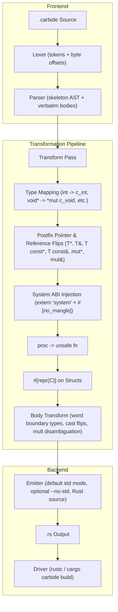
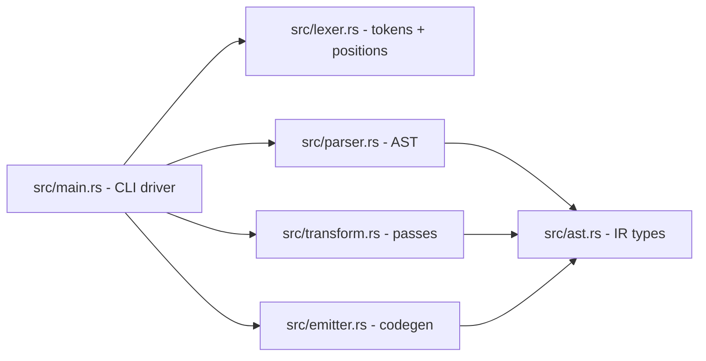

# Carbide — Software Requirements Specification

**Version:** 0.4.0
**Status:** Implemented
**Date:** 2026-08-11

---

## 1. Purpose

Carbide is a transpiler and compiler frontend that compiles **`.carbide`** files —
a low-level, C/C++-flavoured dialect of Rust designed for seamless C ABI and system
FFI compatibility — into standard, FFI-compliant Rust. The dialect provides
C-style primitive keywords, C++-style postfix pointer and reference notations (`*` and `&`),
function-pointer types, and C typedef aliases, which are rewritten to their Rust FFI
equivalents. Every other valid Rust construct passes through verbatim.

This document is the normative specification (SRS) for the transpiler and for
the reference API bindings shipped as fixtures:

1. **CLAP audio API** (`tests/fixtures/clap_audio.carbide`) — the CLever Audio
   Plugin ABI, the cross-DAW audio plugin interface.
2. **raylib API** (`tests/fixtures/raylib_api.carbide`) — the raylib game
   development library API surface (windowing, drawing, textures, audio).
3. **rust_syntax / ffi_compute / apr_types / libc_types** — syntax and ABI integration fixtures.

---

## 2. Terminology

| Term       | Meaning                                                              |
|------------|----------------------------------------------------------------------|
| Carbide    | The source dialect (`.carbide` files).                               |
| Transpile  | The deterministic 1:1 source-to-source rewrite performed by `carbide`.|
| FFI type   | A Rust type usable across the C/System ABI (`core::ffi::c_int`, `*mut T`, …).|
| proc       | Carbide's unsafe-by-default procedure keyword.                       |
| fn-pointer | A function pointer written `fn(params) [-> ret]` in Carbide.         |

---

## 3. Architecture



### 3.1 Pipeline stages

| Stage      | Module       | Responsibility                                                |
|------------|--------------|---------------------------------------------------------------|
| Lexer      | `src/lexer.rs` | Tokenizes the source; records byte offsets for every token so the parser can slice verbatim bodies. |
| Parser     | `src/parser.rs` | Recursive-descent parser for the **structural skeleton**: top-level items, `fn`/`proc` signatures, struct fields, `type` aliases, postfix pointers/references. Enforces C++ postfix pointer/reference notation and rejects prefix `*`/`&` type syntax. Function bodies are captured as verbatim source slices. |
| Transform  | `src/transform.rs` | Applies type substitutions (`int` → `c_int`), postfix pointer/reference flips, system ABI injection (`extern "system"`), `#[repr(C)]`, body-text type and cast rewrites, and binary multiplication disambiguation. |
| Emitter    | `src/emitter.rs` | Reassembles Rust source: default `--std` mode (no `#![no_std]`), optional `--no-std` mode (`#![no_std]`), conditional `use libc::*;`, omission of `void` return arrows, and transformed skeleton with verbatim bodies. |
| Driver     | `src/main.rs` | CLI (`carbide file.carbide [-o out.rs] [-c] [--std] [--no-std]`) and the `cargo carbide build` subcommand. |

### 3.2 Module boundaries



---

## 4. Dialect specification

### 4.1 Files, keywords and Crate Directives

- File extension `.carbide`.
- **Default Mode (`--std`)**: Emits standard library compatible Rust code without `#![no_std]`.
- **Bare-Metal Mode (`--no-std`)**: When `--no-std` is passed, `#![no_std]` is prepended to the generated output.
- Every transpiled file is prefixed with `#![allow(non_camel_case_types)]`, `#![allow(non_snake_case)]`, `#![allow(non_upper_case_globals)]` (FFI style-lint hygiene, mirroring bindgen output).
- `use core::ffi::*;` is always emitted; `use libc::*;` is emitted **conditionally** when any libc type (`size_t`, `ssize_t`, `ptrdiff_t`, `uintptr_t`, `intptr_t`, `off_t`, `pid_t`) appears in the AST.

### 4.2 C primitive type mapping & void handling

| Carbide        | Rust FFI (Value / Parameter) | Rust Return Position |
|----------------|------------------------------|----------------------|
| `void`         | `c_void` (under pointer)     | Omitted / unit `()`  |
| `char`         | `c_char`                     | `c_char`             |
| `signed char`  | `c_schar`                    | `c_schar`            |
| `unsigned char`| `c_uchar`                    | `c_uchar`            |
| `short`        | `c_short`                    | `c_short`            |
| `unsigned short`| `c_ushort`                  | `c_ushort`           |
| `int`          | `c_int`                      | `c_int`              |
| `unsigned int` / `uint` | `c_uint`            | `c_uint`             |
| `long`         | `c_long`                     | `c_long`             |
| `unsigned long`| `c_ulong`                    | `c_ulong`            |
| `long long`    | `c_longlong`                 | `c_longlong`         |
| `unsigned long long` | `c_ulonglong`          | `c_ulonglong`        |
| `float`        | `c_float`                    | `c_float`            |
| `double`       | `c_double`                   | `c_double`           |
| `long double`  | `c_double`                   | `c_double`           |

Rust primitives (`i8`…`i128`, `u8`…`u128`, `isize`, `usize`, `f32`, `f64`,
`bool`, `str`) pass through **unchanged**.

> [!IMPORTANT]
> `void` in function/callback return position (`-> void`) transpiles to unit `()`
> (omitting the `-> ...` return arrow), because `core::ffi::c_void` is an uninhabited
> type in Rust that cannot be returned by value. `void*` and `void const*` map to
> `*mut c_void` and `*const c_void`.

### 4.3 Postfix Pointers and References (C/C++ Conventions Exclusively)

Carbide enforces C and C++ style postfix notation for both pointers (`*`) and references (`&`). Prefix syntax (`*const T`, `*mut T`, `&T`, `&mut T`) in type positions is disallowed in Carbide:

| Carbide Postfix Syntax | Rust Transpiled Form | Description |
|------------------------|----------------------|-------------|
| `T*`                   | `*mut T`             | Mutable raw pointer (C convention) |
| `T mut*`               | `*mut T`             | Explicit mutable raw pointer |
| `T const*`             | `*const T`           | Const raw pointer |
| `T**`                  | `*mut *mut T`        | Double pointer |
| `T* const*`            | `*const *mut T`      | Const pointer to mutable pointer |
| `T&`                   | `&mut T`             | Mutable reference / borrow (C++ convention) |
| `T mut&`               | `&mut T`             | Explicit mutable reference |
| `T const&`             | `&T`                 | Const / immutable reference |

### 4.4 Function declarations

- `fn name(...) [-> T]` → safe `pub extern "system" fn` + `#[no_mangle]`.
- `proc name(...) [-> T]` → `pub unsafe extern "system" fn` + `#[no_mangle]`.
- Explicit `unsafe fn` behaves like `proc`.
- Explicit `extern "ABI"` (e.g. `extern "C" fn ...`) is preserved; if omitted, defaults to `extern "system"`.

### 4.5 Function-pointer types

C/system callbacks are written with `fn` in **type position** — in struct fields,
parameters, return types, and `type` aliases:

```carbide
struct clap_plugin {
    init: fn(plugin: clap_plugin const*) -> bool,
    destroy: fn(plugin: clap_plugin const*) -> void,
    process: fn(plugin: clap_plugin const*, process: clap_process const*) -> clap_process_status
}
```

Emits:

```rust
#[repr(C)]
pub struct clap_plugin {
    pub init: Option<unsafe extern "system" fn(plugin: *const clap_plugin) -> bool>,
    pub destroy: Option<unsafe extern "system" fn(plugin: *const clap_plugin)>,
    pub process: Option<unsafe extern "system" fn(plugin: *const clap_plugin, process: *const clap_process) -> clap_process_status>,
}
```

Rules:

1. Parameter names are preserved.
2. The type is wrapped in `Option<…>` (FFI-safe via null-pointer optimization).
3. The default ABI is `extern "system"` and calling is `unsafe`.
4. Return type `void` omits the `-> ...` return arrow.

### 4.6 Type aliases

C `typedef`s map to `type` items whose RHS is parsed and transformed:

```carbide
type clap_id = u32;
type AudioCallback = fn(buffer: void*, frames: uint) -> void;
type Texture2D = Texture;
```

Emits:

```rust
pub type clap_id = u32;
pub type AudioCallback = Option<unsafe extern "system" fn(buffer: *mut c_void, frames: c_uint)>;
pub type Texture2D = Texture;
```

### 4.7 Structs

- Every struct is `#[repr(C)]` and `pub`.
- Fields support primitives, pointers, references, arrays (`[char; 256]` → `[c_char; 256]`), fn-pointers, and user structs.
- Empty structs (`struct rAudioBuffer {}`) emit as opaque `#[repr(C)]` handles.

### 4.8 Expressions and binary multiplication disambiguation

Carbide disambiguates type cast expressions from binary arithmetic:
- `x as usize * y`: `*` followed by an operand is preserved as arithmetic multiplication (`(x as usize) * y`).
- `x as void*`: postfix pointer cast is converted to prefix `x as *mut c_void`.
- `x as void const*`: converted to `x as *const c_void`.
- `let r: int& = ...`: converted to `let r: &mut c_int = ...`.
- `let r: int const& = ...`: converted to `let r: &c_int = ...`.

---

## 5. Reference API bindings

The repository ships verified reference bindings:
- `tests/fixtures/clap_audio.carbide`: CLAP 1.2 audio plugin ABI.
- `tests/fixtures/raylib_api.carbide`: raylib game development library API surface.
- `tests/fixtures/rust_syntax.carbide`: Comprehensive syntax, references, and expressions suite.
- `tests/fixtures/rust_primitives.carbide`: Rust primitive passthrough suite.
- `tests/fixtures/libc_types.carbide` / `apr_types.carbide`: APR and libc integration suites.

---

## 6. Testing strategy

| Suite | File | Coverage |
|-------|------|----------|
| Unit tests | inline in `src/*.rs` | Lexer, parser (postfix references/pointers, rejection of prefix syntax, types, aliases), transform (ABI, multiplication, casts), emitter (default std and `--no-std`) |
| Fixture content | `tests/fixture_tests.rs` | Transpiles all `.carbide` fixtures in default `--std` mode, `--no-std` mode, and `--std` mode |
| Compile integration | `tests/integration_tests.rs` | Transpiles and compiles all fixtures with `rustc --crate-type=lib` in both default and `--no-std` modes |

---

## 7. Build and run

```powershell
# Build compiler
cargo build

# Run all tests
cargo test

# Transpile a single file (default: std mode)
.\target\debug\carbide.exe input.carbide -o output.rs

# Transpile with explicit --no-std
.\target\debug\carbide.exe input.carbide -o output.rs --no-std

# Build using Cargo driver
cargo carbide build
```
