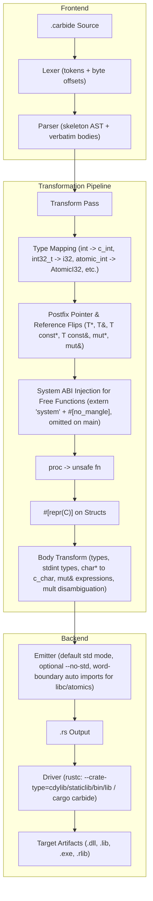

# Carbide — Software Requirements Specification

**Version:** 0.8.0
**Status:** Implemented
**Date:** 2026-08-11

---

## 1. Purpose

Carbide is a transpiler and compiler frontend that compiles **`.carbide`** files —
a low-level, C/C++-flavoured dialect of Rust designed for seamless C ABI and system
FFI compatibility — into standard, FFI-compliant Rust, and directly drives `rustc`
to produce static libraries (`.lib`/`.a`), dynamic DLLs (`.dll`/`.so`/`.dylib`), or executables (`.exe`). The dialect provides
C-style primitive keywords, standard fixed-width types (`<stdint.h>`), C++-style postfix pointer and reference notations (`*` and `&`),
C11/C++ atomic types, function-pointer types, and C typedef aliases, which are rewritten to their Rust FFI
equivalents. Every other valid Rust construct passes through verbatim.

This document is the normative specification (SRS) for the transpiler and for
the reference API bindings shipped as fixtures:

1. **CLAP audio API** (`tests/fixtures/clap_audio.carbide`) — the CLever Audio
   Plugin ABI, the cross-DAW audio plugin interface.
2. **raylib API** (`tests/fixtures/raylib_api.carbide`) — the raylib game
   development library API surface (windowing, drawing, textures, audio).
3. **stdint_posix / atomics_operators / rust_syntax / ffi_compute / apr_types / libc_types** — syntax, atomics, fixed-width types, and ABI integration fixtures.

---

## 2. Terminology

| Term       | Meaning                                                              |
|------------|----------------------------------------------------------------------|
| Carbide    | The source dialect (`.carbide` files).                               |
| Transpile  | The deterministic 1:1 source-to-source rewrite performed by `carbide`.|
| FFI type   | A Rust type usable across the C/System ABI (`core::ffi::c_int`, `*mut T`, …).|
| proc       | Carbide's unsafe-by-default procedure keyword.                       |
| fn-pointer | A function pointer written `fn(params) [-> ret]` in Carbide.         |
| cdylib     | C-compatible dynamic link library (`.dll`, `.so`, `.dylib`).          |
| staticlib  | C-compatible static archive (`.lib`, `.a`).                          |

---

## 3. Architecture



---

## 4. Dialect specification

### 4.1 C primitive, fixed-width & atomic type mapping

| Carbide Type | Rust FFI / Core Equivalent | Description |
|:---|:---|:---|
| `void` | `c_void` (under pointers) / omitted `()` | Uninhabited / unit return |
| `char` | `c_char` | C char (1 byte) |
| `signed char` / `unsigned char` | `c_schar` / `c_uchar` | Signed / unsigned 8-bit char |
| `short` / `unsigned short` | `c_short` / `c_ushort` | 16-bit integers |
| `int` / `unsigned int` (`uint`) | `c_int` / `c_uint` | 32-bit integers |
| `long` / `unsigned long` | `c_long` / `c_ulong` | C long integer |
| `long long` / `unsigned long long` | `c_longlong` / `c_ulonglong` | 64-bit integer |
| `float` / `double` / `long double` | `c_float` / `c_double` / `c_double` | Floating point types |
| `int8_t` / `uint8_t` | `i8` / `u8` | Fixed-width 8-bit integer |
| `int16_t` / `uint16_t` | `i16` / `u16` | Fixed-width 16-bit integer |
| `int32_t` / `uint32_t` | `i32` / `u32` | Fixed-width 32-bit integer |
| `int64_t` / `uint64_t` | `i64` / `u64` | Fixed-width 64-bit integer |
| `intmax_t` / `uintmax_t` | `i64` / `u64` | Max width integer |
| `char16_t` / `char32_t` | `u16` / `u32` | Unicode UTF-16 / UTF-32 code units |
| `int_least8_t` .. `int_least64_t` | `i8` .. `i64` | Least-width integer types |
| `int_fast8_t` .. `int_fast64_t` | `i8` .. `i64` | Fast-width integer types |
| `atomic_bool` | `core::sync::atomic::AtomicBool` | C11/C++ atomic boolean |
| `atomic_int` / `atomic_uint` | `core::sync::atomic::AtomicI32` / `AtomicU32` | 32-bit atomic integers |
| `atomic_long` / `atomic_ulong` | `core::sync::atomic::AtomicI64` / `AtomicU64` | 64-bit atomic integers |
| `atomic_size_t` / `atomic_uintptr_t` | `core::sync::atomic::AtomicUsize` | Size-width atomic integer |
| `atomic_intptr_t` | `core::sync::atomic::AtomicIsize` | Pointer-width signed atomic integer |

### 4.2 Extended libc, Sockets & POSIX Types
Carbide uses word-boundary identifier scanning and automatically imports `use libc::*;` when any of the following types appear in the source:
- **Sizes & Offsets**: `size_t`, `ssize_t`, `ptrdiff_t`, `intptr_t`, `uintptr_t`, `off_t`, `off64_t`, `wchar_t`
- **Processes & Users**: `pid_t`, `uid_t`, `gid_t`, `id_t`, `idtype_t`
- **Filesystem & Streams**: `mode_t`, `dev_t`, `ino_t`, `ino64_t`, `nlink_t`, `blksize_t`, `blkcnt_t`, `FILE`, `fpos_t`, `DIR`, `dirent`, `stat`, `stat64`
- **Time & Clocks**: `time_t`, `clock_t`, `clockid_t`, `suseconds_t`, `timespec`, `timeval`
- **Scatter/Gather I/O & Multiplexing**: `iovec`, `pollfd`, `nfds_t`, `fd_set`
- **Sockets & Networking**: `socklen_t`, `sa_family_t`, `sockaddr`, `sockaddr_in`, `sockaddr_in6`, `sockaddr_storage`, `sockaddr_un`, `in_addr`, `in6_addr`, `in_addr_t`, `in_port_t`, `msghdr`, `cmsghdr`
- **Pthreads & Synchronization**: `pthread_t`, `pthread_mutex_t`, `pthread_mutexattr_t`, `pthread_cond_t`, `pthread_condattr_t`, `pthread_rwlock_t`, `pthread_rwlockattr_t`, `pthread_key_t`, `pthread_once_t`, `pthread_attr_t`
- **Signals & Resources**: `sigset_t`, `siginfo_t`, `sig_atomic_t`, `rlimit`, `rlimit64`, `rusage`, `rlim_t`
- **Variadics & Dynamic Linking**: `va_list`, `Dl_info`

### 4.3 Postfix Pointers and References (C/C++ Conventions Exclusively)

| Carbide Postfix Syntax | Rust Transpiled Form | Description |
|------------------------|----------------------|-------------|
| `T*` or `T mut*`       | `*mut T`             | Mutable raw pointer |
| `T const*`             | `*const T`           | Const raw pointer |
| `T&` or `T mut&`       | `&mut T`             | Mutable reference / borrow |
| `T const&`             | `&T`                 | Const reference / borrow |
| `T**`                  | `*mut *mut T`        | Double pointer |
| `mut& expr` (in expressions) | `&mut expr`    | Mutable borrow expression |

Prefix syntax (`*const T`, `*mut T`, `&T`, `&mut T`, `const T*`, `const T&`) in type positions is rejected with clear diagnostic errors.

---

## 5. Build and run

```powershell
# Build compiler
cargo build

# Run all tests
cargo test

# Compile directly to a dynamic DLL
carbide plugin.carbide --dll -o plugin.dll

# Compile directly to a static library
carbide engine.carbide --static -o engine.lib

# Compile directly to an executable
carbide app.carbide --exe -o app.exe

# Build using Cargo driver
cargo carbide build
```
